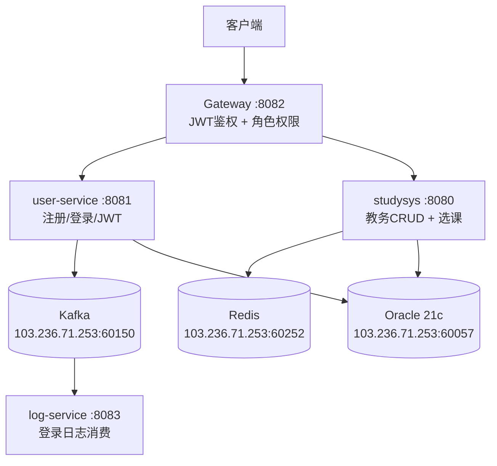

# 教务管理系统微服务

基于 Spring Boot 4.0.6 + Spring Cloud 构建的分布式教务管理系统，采用微服务架构，涵盖课程管理、学生管理、教师管理、成绩管理、选课管理、用户认证与权限控制等核心业务功能。

## 项目架构

```
D:\springboot\
├── studysys/          # 业务服务 - 核心教务 CRUD + 选课管理 (port 8080)
├── user-service/      # 认证服务 - JWT + Spring Security (port 8081)
├── gateway-service/   # 网关服务 - 路由转发 + JWT 鉴权 + 角色权限 (port 8082)
└── log-service/       # 日志服务 - Kafka 集中消费登录日志 (port 8083)
```

## 技术栈

| 技术 | 版本 | 用途 |
|------|------|------|
| Spring Boot | 4.0.6 | 微服务基础框架 |
| Spring Cloud Gateway | 5.0.1 (WebFlux) | API 网关 |
| MyBatis | 4.0.1 | ORM 持久层 |
| Oracle 21c XE (Docker) | 21-full | 数据库（远程服务器） |
| Redis 7 (Docker) | 7-alpine | 缓存（远程服务器） |
| Kafka 7.7.2 (Docker) | cp-kafka | 消息队列（远程服务器） |

## 快速启动

### 前置条件

- JDK 21+
- Maven 3.9+
- 远程服务器上的中间件已启动（Oracle、Redis、Kafka）

### 启动服务（按顺序）

```bash
# 编译所有模块
cd D:\springboot

# 启动业务服务 (8080)
cd studysys && mvn spring-boot:run

# 启动日志服务 (8083)
cd ../log-service && mvn spring-boot:run

# 启动认证服务 (8081)
cd ../user-service && mvn spring-boot:run

# 启动网关服务 (8082)
cd ../gateway-service && mvn spring-boot:run
```

统一入口：`http://localhost:8082/api/**`

## 服务详情

### 1. studysys -- 核心业务服务 (port 8080)

| 模块 | 实体 | 说明 |
|------|------|------|
| 院系管理 | Department | 院系 CRUD |
| 学生管理 | Student | 学生信息 + 所属院系 |
| 教师管理 | Teacher | 教师信息 |
| 课程管理 | Course | 课程信息 |
| 成绩管理 | Grade | 学生成绩 + 分页查询 |
| **课程安排** | **CourseSchedule** | **排课管理（星期、节次、容量）** |
| **选课管理** | **Enrollment** | **学生选课/退选 + 时间冲突检查** |

- MyBatis XML 动态 SQL
- Redis 缓存（@Cacheable / @CachePut / @CacheEvict）
- 全局异常处理，Oracle 错误码精准匹配
- Swagger 接口文档：`http://localhost:8080/swagger-ui.html`

### 2. user-service -- 认证服务 (port 8081)

| 功能 | 说明 |
|------|------|
| 用户注册 | 教师/学生角色需校验 referenceId 存在性，不允许重复注册 |
| 用户登录 | BCrypt 校验密码，生成 JWT Token |
| JWT 鉴权 | OncePerRequestFilter + SecurityContextHolder |

- 注册时通过 HTTP 调用 studysys 接口校验教师/学生 ID 是否存在
- 数据库唯一约束防止用户名和 referenceId 重复
- 登录成功后发送 Kafka 消息到 login-events 主题

### 3. gateway-service -- 网关服务 (port 8082)

| 功能 | 说明 |
|------|------|
| 路由转发 | `/api/user/**` → user-service, `/api/**` → studysys |
| JWT 鉴权 | GlobalFilter 校验所有请求（白名单除外） |
| 角色权限控制 | 基于角色的 API 访问控制 |
| 用户信息透传 | 通过 `userId` / `role` 请求头传递 |

**白名单：** `/api/user/login`, `/api/user/register`, `/api/swagger-ui/**`

**角色权限矩阵：**

| API | ADMIN | teacher | student |
|-----|-------|---------|---------|
| `/api/user/**` | ✅ | ❌ | ❌ |
| `/api/grade/**` (写) | ✅ | ✅ | ❌ |
| `/api/enrollment/enroll` | ✅ | ❌ | ✅ |
| `/api/enrollment/drop` | ✅ | ❌ | ✅ |
| `/api/enrollment/my/**` | ✅ | ❌ | ✅ |
| `/api/enrollment/schedule/**` | ✅ | ✅ | ❌ |
| 其他 API (GET) | ✅ | ✅ | ✅ |
| 其他 API (POST/PUT/DELETE) | ✅ | ❌ | ❌ |

### 4. log-service -- 日志服务 (port 8083)

| 功能 | 说明 |
|------|------|
| 登录事件 | 监听 login-events 主题，打印登录日志 |

- 纯 Kafka 消费端，无数据库依赖

## API 接口一览

### 账号认证

| 方法 | 路径 | 说明 |
|------|------|------|
| POST | `/api/user/register` | 注册（仅 teacher/student，需校验 referenceId） |
| POST | `/api/user/login` | 登录，返回 JWT Token |
| GET | `/api/user` | 用户列表（仅 ADMIN） |
| GET | `/api/user/{id}` | 用户详情（仅 ADMIN） |

### 课程安排

| 方法 | 路径 | 说明 |
|------|------|------|
| GET | `/api/course-schedule` | 查看所有课程安排 |
| GET | `/api/course-schedule/{id}` | 查看单个安排 |
| POST | `/api/course-schedule` | 新增排课（ADMIN/teacher） |
| PUT | `/api/course-schedule` | 修改排课（ADMIN/teacher） |
| DELETE | `/api/course-schedule/{id}` | 删除排课（ADMIN/teacher） |

### 选课管理

| 方法 | 路径 | 说明 |
|------|------|------|
| POST | `/api/enrollment/enroll?studentId=&scheduleId=` | 选课（含重复、容量、时间冲突检查） |
| POST | `/api/enrollment/drop?enrollmentId=` | 退选 |
| GET | `/api/enrollment/my/{studentId}` | 查看我的选课 |
| GET | `/api/enrollment/schedule/{scheduleId}` | 查看课程选课名单 |

### 基础 CRUD

| 方法 | 路径 | 说明 |
|------|------|------|
| GET/POST/PUT/DELETE | `/api/course[/{id}]` | 课程 CRUD |
| GET/POST/PUT/DELETE | `/api/student[/{id}]` | 学生 CRUD |
| GET/POST/PUT/DELETE | `/api/teacher[/{id}]` | 教师 CRUD |
| GET/POST/PUT/DELETE | `/api/department[/{id}]` | 院系 CRUD |
| GET/POST/PUT/DELETE | `/api/grade[/{id}]` | 成绩 CRUD |

## 接口示例

```bash
# 注册学生
POST http://localhost:8082/api/user/register
Content-Type: application/json

{"username":"student1","password":"123456","role":"student","referenceId":1}

# 注册教师
POST http://localhost:8082/api/user/register
Content-Type: application/json

{"username":"teacher1","password":"123456","role":"teacher","referenceId":1}

# 登录（获取 Token）
POST http://localhost:8082/api/user/login
Content-Type: application/json

{"username":"student1","password":"123456"}

# 携带 Token 查询课程
GET http://localhost:8082/api/course
Authorization: Bearer <token>

# 学生选课
POST http://localhost:8082/api/enrollment/enroll?studentId=1&scheduleId=1
Authorization: Bearer <token>
```

## 架构图



## 测试文件

`test.http` 文件包含了完整的 API 测试用例，涵盖注册、登录、选课、角色权限验证等场景。

## 开发环境

- IDE: VS Code
- JDK: 21
- Maven: 3.9+
- OS: Windows

MIT License
