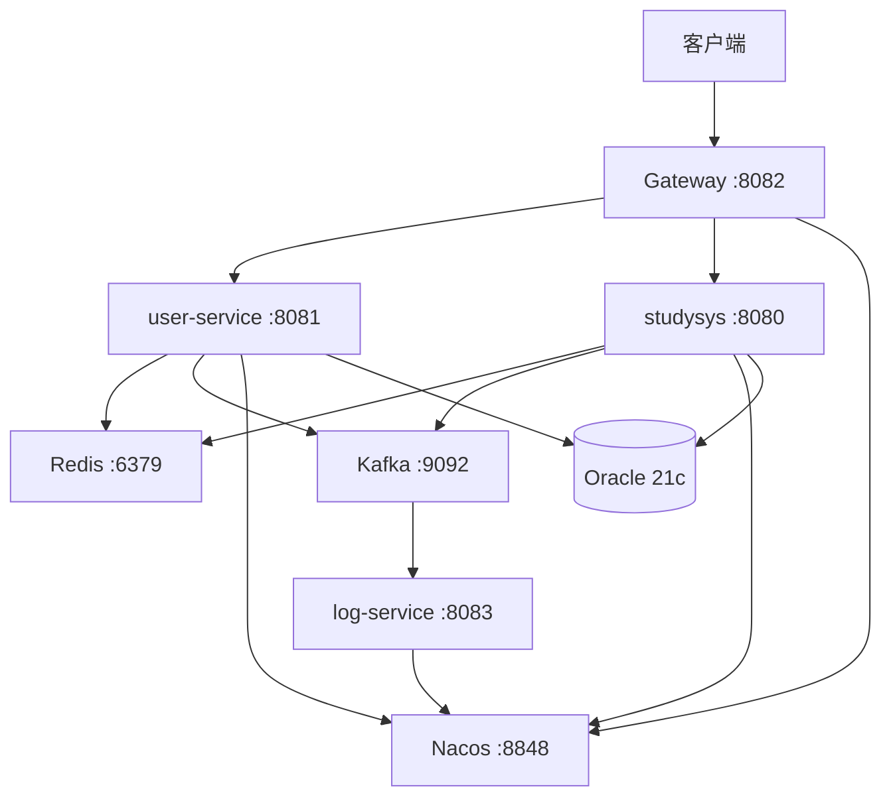

# 教务管理系统微服务

基于 Spring Boot 4.0.6 + Spring Cloud 构建的分布式教务管理系统，采用微服务架构，涵盖课程管理、学生管理、教师管理、成绩管理、用户认证等核心业务功能。

## 项目架构

```
D:\springboot\
├── studysys/          # 业务服务 - 核心教务 CRUD (port 8080)
├── user-service/      # 认证服务 - JWT + Spring Security (port 8081)
├── gateway-service/   # 网关服务 - 路由转发 + JWT 鉴权 (port 8082)
└── log-service/       # 日志服务 - Kafka 集中消费日志 (port 8083)
```

## 技术栈

| 技术 | 版本 | 用途 |
|------|------|------|
| Spring Boot | 4.0.6 | 微服务基础框架 |
| Spring Cloud | 2025.1.1 | 微服务治理 |
| Spring Cloud Gateway | 5.0.1 (WebFlux) | API 网关 |
| Spring Security | 随 Boot 4.x | 用户认证授权 |
| MyBatis | 4.0.1 | ORM 持久层 |
| Oracle 21c XE (Docker) | 21-full | 数据库 |
| Redis 7 (Docker) | 7-alpine | 缓存 |
| Kafka 7.7.2 (Docker) | cp-kafka | 消息队列 |
| Nacos 2.3.2 (Docker) | v2.3.2 | 服务注册与发现 |
| JJWT | 0.12.6 | JWT 令牌 |
| PageHelper | 2.1.0 | 分页 |
| SpringDoc OpenAPI | 2.8.4 | 接口文档 |
| Spring Cloud LoadBalancer | - | 客户端负载均衡 |
| Nacos Discovery | 2025.1.0.0 | 服务发现 |

## 快速启动

### 前置条件

- JDK 21+
- Docker Desktop（用于启动 Oracle、Redis、Kafka、Nacos 等中间件）
- Maven 3.9+

### 1. 启动中间件容器

```bash
# Oracle 21c XE
docker run -d --name oracle-xe \
  -p 1521:1521 -p 5500:5500 \
  -e ORACLE_PASSWORD=205043 \
  -e APP_USER=my_user \
  -e APP_USER_PASSWORD=205043 \
  gvenzl/oracle-xe:21-full

# Redis 7
docker run -d --name redis -p 6379:6379 redis:7-alpine

# Zookeeper + Kafka
docker run -d --name zookeeper -p 2181:2181 zookeeper:3.9
docker run -d --name kafka -p 9092:9092 \
  -e KAFKA_ZOOKEEPER_CONNECT=host.docker.internal:2181 \
  -e KAFKA_ADVERTISED_LISTENERS=PLAINTEXT://localhost:9092 \
  -e KAFKA_OFFSETS_TOPIC_REPLICATION_FACTOR=1 \
  confluentinc/cp-kafka:7.7.2

# Nacos
docker run -d --name nacos -p 8848:8848 -p 9848:9848 \
  -e MODE=standalone \
  -e NACOS_AUTH_TOKEN=$(echo -n "springboot-microservices-secret-key" | base64) \
  -e NACOS_AUTH_IDENTITY_KEY=nacos \
  -e NACOS_AUTH_IDENTITY_VALUE=nacos \
  nacos/nacos-server:v2.3.2
```

### 2. 初始化数据库

执行 SQL 脚本创建业务表（详见各服务下的 SQL 文件）。

### 3. 启动服务（按顺序）

```bash
# 编译所有模块
cd D:\springboot

# 启动业务服务 (8080)
cd studysys && mvn spring-boot:run

# 启动认证服务 (8081)
cd ../user-service && mvn spring-boot:run

# 启动网关服务 (8082)
cd ../gateway-service && mvn spring-boot:run

# 启动日志服务 (8083)
cd ../log-service && mvn spring-boot:run
```

也可以通过网关统一入口访问：`http://localhost:8082/api/**`

## 服务详情

### 1. studysys -- 核心业务服务 (port 8080)

| 模块 | 实体 | 说明 |
|------|------|------|
| 院系管理 | Department | 院系 CRUD |
| 学生管理 | Student | 学生信息 + 所属院系 |
| 教师管理 | Teacher | 教师信息 |
| 课程管理 | Course | 课程信息 |
| 成绩管理 | Grade | 学生成绩 + 分页查询 |

- 使用 MyBatis XML 动态 SQL
- Redis 缓存（30 分钟 TTL），@Cacheable / @CachePut / @CacheEvict
- 全局异常处理，Oracle 错误码精准匹配
- Swagger 接口文档：`http://localhost:8080/swagger-ui.html`

### 2. user-service -- 认证服务 (port 8081)

| 功能 | 说明 |
|------|------|
| 用户注册 | BCrypt 加密密码，存储到 Oracle |
| 用户登录 | 校验密码，生成 JWT Token |
| JWT 鉴权 | OncePerRequestFilter + SecurityContextHolder |

- 登录成功后发送 Kafka 消息到 login-events 主题
- 支持 Swagger 文档

### 3. gateway-service -- 网关服务 (port 8082)

| 功能 | 说明 |
|------|------|
| 路由转发 | /api/user/** -> user-service, /api/** -> studysys |
| JWT 鉴权 | GlobalFilter 校验所有请求（白名单除外） |
| 用户信息透传 | 通过 X-User-Id / X-User-Role 请求头传递 |

- 白名单：/api/user/login, /api/user/register, /api/swagger-ui/**
- 基于 Nacos 的服务发现（lb:// 负载均衡）

### 4. log-service -- 日志服务 (port 8083)

| 功能 | 说明 |
|------|------|
| 登录事件 | 监听 login-events 主题 |
| 数据库错误 | 监听 db-errors 主题 |
| 操作日志 | 监听 operation-logs 主题 |

- 纯 Kafka 消费端，无数据库依赖
- 注册到 Nacos，支持动态扩缩

## 接口示例

```bash
# 注册
POST http://localhost:8082/api/user/register
Content-Type: application/json

{"username":"admin","password":"123456","role":"admin"}

# 登录（获取 Token）
POST http://localhost:8082/api/user/login
Content-Type: application/json

{"username":"admin","password":"123456"}

# 携带 Token 访问业务接口
GET http://localhost:8082/api/students
Authorization: Bearer <token>
```

## 测试文件

项目中包含了完整的 HTTP 测试文件：

- studysys/test.http -- 5 张表的 CRUD 测试
- user-service/test1.http -- 用户注册/登录测试
- gateway-service/test2.http -- 网关 JWT 鉴权测试

## 架构图



## 开发环境

- IDE: VS Code / IntelliJ IDEA
- JDK: 21
- Maven: 3.9+
- Docker: 24+
- OS: Windows / macOS / Linux

## 许可证

MIT License
